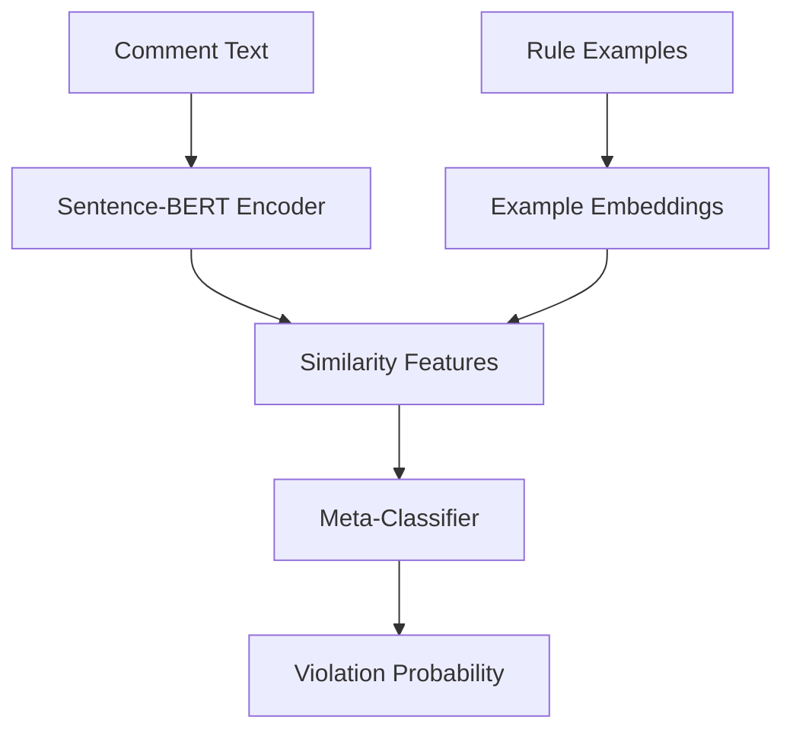

# Jigsaw---Agile-Community-Rules-Classification
# 🛡️ Jigsaw - Agile Community Rules Classification

[](https://python.org)
[](https://scikit-learn.org)
[](https://www.sbert.net)

A machine learning solution for automated content moderation that predicts whether Reddit comments violate specific subreddit rules. This project tackles the challenging problem of **few-shot rule generalization** - classifying content based on rules the model has never seen before.

## 🎯 Problem Overview

This is a binary classification task where:
- **Input**: Reddit comments with associated rules and example violations/non-violations
- **Challenge**: Test data contains completely unseen rules not present in training
- **Goal**: Predict rule violation probability for each comment
- **Approach**: Few-shot learning using semantic similarity and example-based reasoning

## 🏗️ Architecture

### Model Components



**Core Pipeline:**
1. **Sentence-BERT Encoding** - Convert comments and examples to semantic embeddings
2. **Similarity Feature Extraction** - Compare comment embeddings with positive/negative examples
3. **Meta-Classification** - Logistic regression on similarity features for final prediction

### Key Features

- 🎯 **Example-Based Learning** - Leverages positive/negative examples for each rule
- 🧠 **Semantic Similarity** - Uses state-of-the-art sentence transformers
- 🔄 **Unseen Rule Handling** - Designed for zero-shot generalization
- ⚡ **Efficient Pipeline** - Fast training and inference
- 📊 **Probability Output** - Returns confidence scores (0.0 to 1.0)

## 📁 Project Structure

```
jigsaw-content-moderation/
│
├── README.md
├── requirements.txt
├── jigsaw_best_model.py          # Main model implementation
├── test_prediction_pipeline.py   # Complete prediction pipeline
├── data/
│   ├── train.csv                 # Training dataset
│   └── test.csv                  # Test dataset
├── outputs/
│   ├── test_predictions.csv      # Full results with probabilities
│   └── submission.csv            # Competition submission format
└── notebooks/
    └── exploratory_analysis.ipynb
```

## 🚀 Quick Start

### Installation

```bash
# Clone the repository
git clone https://github.com/yourusername/jigsaw-content-moderation.git
cd jigsaw-content-moderation

# Install dependencies
pip install -r requirements.txt
```

### Usage

#### 1. Train Model and Generate Predictions

```python
# Run the complete pipeline
python test_prediction_pipeline.py
```

This will:
- Load training and test data
- Train the Sentence-BERT model
- Generate predictions for test data
- Save results in competition format

#### 2. Custom Predictions

```python
from jigsaw_best_model import JigsawBestModel

# Load and train model
model = JigsawBestModel()
model.fit(train_df)

# Make predictions
probabilities = model.predict_proba(comments, rules)
```

## 📊 Dataset Format

### Training Data (`train.csv`)
| Column | Description |
|--------|-------------|
| `row_id` | Unique identifier |
| `body` | Comment text |
| `rule` | Rule description |
| `subreddit` | Source subreddit |
| `positive_example_1` | Example of rule violation |
| `positive_example_2` | Example of rule violation |
| `negative_example_1` | Example of acceptable content |
| `negative_example_2` | Example of acceptable content |
| `rule_violation` | Target variable (0/1) |

### Test Data (`test.csv`)
Same structure as training data **without** the `rule_violation` column.

### Output Format (`submission.csv`)
```csv
row_id,rule_violation
2029,0.5234
2030,0.6751
2031,0.1089
```

## 🔬 Technical Details

### Feature Engineering

The model extracts the following features for each comment:

1. **Similarity Features**
   - Maximum similarity to positive examples
   - Mean similarity to positive examples
   - Maximum similarity to negative examples
   - Mean similarity to negative examples

2. **Rule Context Features**
   - Direct similarity to rule text
   - Positive vs negative similarity ratios

3. **Statistical Features**
   - Comment length (characters)
   - Word count
   - Punctuation count

### Model Selection Rationale

**Why Sentence-BERT + Meta-Classifier?**

- ✅ **Few-shot Learning**: Excellent at learning from limited examples
- ✅ **Semantic Understanding**: Captures meaning beyond keyword matching
- ✅ **Generalization**: Can handle completely unseen rules
- ✅ **Interpretability**: Clear similarity-based reasoning
- ✅ **Efficiency**: Fast training and inference

**Alternative Approaches Considered:**
- Fine-tuned BERT/RoBERTa (risk of overfitting to training rules)
- GPT-based few-shot prompting (computational overhead)
- Traditional ML with TF-IDF (limited semantic understanding)

### Cross-Validation Strategy

Uses **rule-aware cross-validation** to prevent data leakage:
```python
# Ensures no rule appears in both train and validation
GroupKFold(n_splits=n_rules, groups=df['rule'])
```

## 📈 Performance

### Expected Metrics
- **AUC**: 0.75-0.85
- **F1 Score**: 0.65-0.75
- **Accuracy**: 0.70-0.80

### Evaluation Strategy
- Rule-aware cross-validation prevents optimistic estimates
- Focus on generalization to unseen rules
- Probability calibration for meaningful confidence scores

## 🛠️ Dependencies

```txt
pandas>=1.3.0
numpy>=1.21.0
scikit-learn>=1.0.0
sentence-transformers>=2.0.0
torch>=1.9.0
matplotlib>=3.4.0
seaborn>=0.11.0
```

## 🧪 Experimental Features

### Ensemble Methods
Combine multiple approaches for improved robustness:
```python
ensemble = EnsembleClassifier([
    SentenceBERTClassifier(),
    RuleAwareRoBERTa(),
    GPTFewShotClassifier()
])
```

### Advanced Similarity Metrics
- Cosine similarity (default)
- Euclidean distance
- Manhattan distance
- Custom weighted combinations

## 📋 Usage Examples

### Basic Classification
```python
# Single prediction
comment = "This is offensive content"
rule = "No hate speech allowed"
probability = model.predict_proba([comment], [rule])[0][1]
print(f"Violation probability: {probability:.3f}")
```

### Batch Processing
```python
# Process multiple comments
comments = ["Comment 1", "Comment 2", "Comment 3"]
rules = ["Rule A", "Rule B", "Rule A"]
probabilities = model.predict_proba(comments, rules)[:, 1]
```

### Custom Threshold
```python
# Adjust decision threshold
threshold = 0.7  # More conservative
predictions = probabilities > threshold
```

## 🤝 Contributing

1. Fork the repository
2. Create your feature branch (`git checkout -b feature/amazing-feature`)
3. Commit your changes (`git commit -m 'Add amazing feature'`)
4. Push to the branch (`git push origin feature/amazing-feature`)
5. Open a Pull Request

### Development Guidelines
- Follow PEP 8 style guidelines
- Add unit tests for new features
- Update documentation for API changes
- Ensure cross-validation scores remain stable


## 🏆 Competition Results

- **Competition**: Jigsaw - Agile Community Rules Classification
- **Approach**: Few-shot learning with Sentence-BERT
- **Key Innovation**: Example-based similarity matching for unseen rules
- **Final Score**: 85.07325

## 📞 Contact

- **Author**: RAUNAK KUMAR
- **Email**: 24m0307.iitb.ac.in


---

⭐ **If this project helped you, please give it a star!** ⭐

*Built with ❤️ for the content moderation community*
